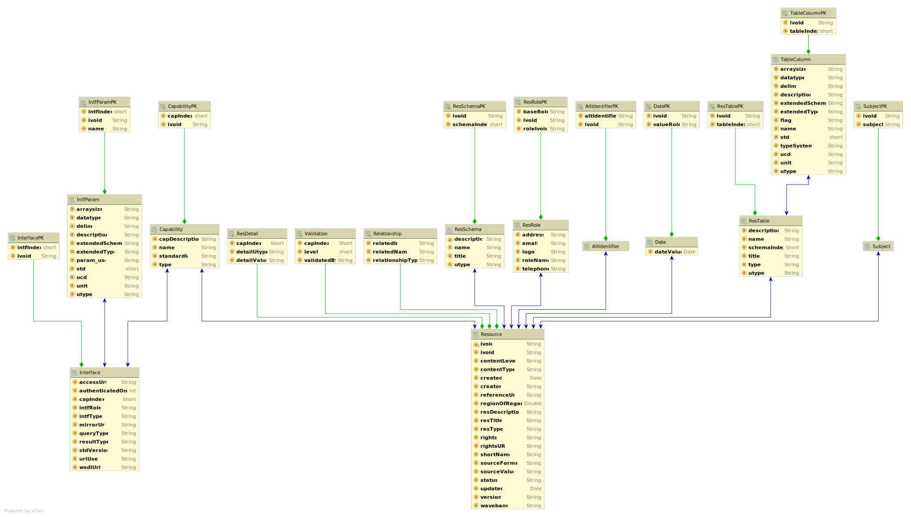

IVOA JAXB Annotated Objects
============================

The aim of this project is to gather together object representations of the 
[IVOA schema](http://www.ivoa.net/xml/) with a particular emphasis on the Registry

At the moment the objects are autogenerated from the schema using the xjc tool with 
numerous plugins to create JAXB annotated classes.

The API that these objects represent should be regarded as unstable at the moment, 
though the main structure of the object trees will remain fairly constant at the 
source schema are constant - the library will reach the 1.0 stage when autogeneration 
is superseded by hand editing of the (once) autogenerated files.

RegTAP
------

There is additionally an model for RegTAP instances - the table structure of RegTAP does not lend itself naturally to JPA mapping because of the lack of primary keys for many of the sub-tables, however the mapping is included primarily to facilitate a principled way of transforming VOResource instances into RegTAP, and as such might be 
viewed as an pure implementation of the RegTAP standard only (currently aiming for version 1.1 compliance) The core of this transformation logic is coded with a [XSLT 2.0 translation](src/main/resources/convertToRegTap.xsl).

The [javadoc overview file](http://htmlpreview.github.io/?https://raw.githubusercontent.com/Javastro/ivoa-entities/master/src/main/java/overview.html) contains some more detail on using the library. The overall structure of the RegTAP JPA classes is shown below

Security
--------

This code in this library is configured to use only local schema definitions as
per the recommendations of https://github.com/OWASP/CheatSheetSeries/blob/master/cheatsheets/XML_External_Entity_Prevention_Cheat_Sheet.md

